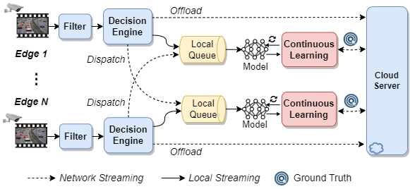
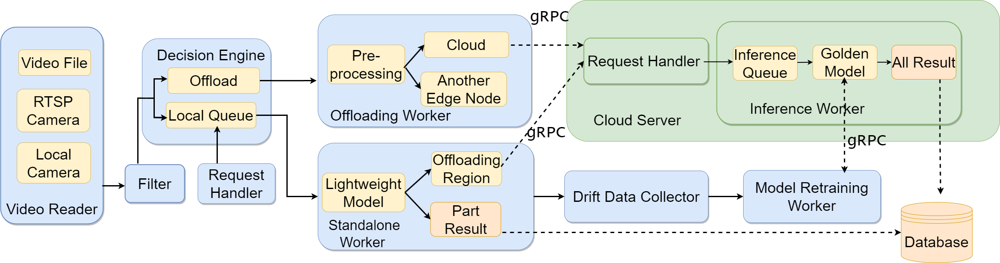

# EdgeCam: A Distributed Camera System for Inference Scheduling and Continuous Learning in Video Analytics


## Overview

<div align="center">

</div>

EdgeCam, an open-source distributed camera system that incorporates inference scheduling and continuous learning for video analytics. 
The system comprises multiple edge nodes and the cloud, enabling collaborative video analytics. 
The edge node also gathers drift data to support continuous learning and maintain recognition accuracy.


Firstly, for the video collected from on-edge camera, our system support a filter engine that can determine whether a video frame needs to be filtered or not, so as to save the downstream resource costs.
Then, our system have a decision engine to intelligently select offloading strategies for video frames, while adjusting their resolutions and encoding qualities adaptively.
Moreover, EdgeCam implements continuous learning to enhance the accuracy of lightweight models on edge nodes, enabling them to handle data drift.

The main implementation details of EdgeCam are shown below.

<div align="center">

</div>


| modules | Description |
| :---: |    :----   |
| Video Reader | Provides user-friendly interfaces for reading video streams using OpenCV. Supports offline video files and network cameras using the Real-Time Streaming Protocol (RTSP). | VideoProcessor |
| Filter |  Aims to filter out the redundant video frames. Implements four methods to compute differences. | DiffProcessor |
| Decision Engine | Encapsulates different offloading and video processing policies, each governing the workflow of video frames. | 
| Standalone Worker | A thread that continuously extracts tasks from the local queue and then uses the locally deployed DNN model to perform inference.| 
| Offloading Worker | Each offloading task will be assigned an offloading thread from the thread pool. The offloading thread dispatches the task to the corresponding edge server or offloads it to the cloud server.|
| Drift Data Collector | Periodically selects a subset of video frames with lower average confidence in the predicted results from locally inferred frames. |
| Model Retraining Worker | A thread that sends the selected frames for retraining to the cloud to get ground truth accuracy. Utilizes these frames and ground truth to retrain the current model.|
| Request Handler | A thread that listens to the requests from the edge nodes.|


## Install

**On edge** 

Please install the following libraries on each edge node.
1. Install the deep learning framework pytorch and opencv-python on the [Jetson](https://forums.developer.nvidia.com/t/pytorch-for-jetson/72048).
2. Install dependent libraries.
```bash
pip3 install munch
pip3 install grpcio
pip3 install grpcio-tools
pip3 install loguru
pip3 install mysql-connector-python
pip3 install mapcalc
pip3 install APScheduler
pip3 install imutils
pip3 install PyYAML
```
**On cloud**

Similar to the installation on the edge node, install the corresponding version of Pytorch and required libraries.

**Database**

1. Installthe MySQL database.
```bash
sudo apt install mysql-server
```
2. The MySQL database is configured to allow remote connections.

## Usage

#### 1. Modify the configuration file (config/config.yaml) as needed.

**Video Source**

If the video source is a video file, please configure the path of the video file.
```
video_path: your video path
```

If the video source is a network camera, please configure the account, password, and IP address.
```
rtsp:
 label: True
 account: your account
 password: your password
 ip_address: your camera ip
 channel: 1
```

**Feature Type**

One can choose different features to calculate video frame difference, including pixel, edge, area, and corner features.
```
feature: edge
```

**IP configuration**

Please configure the IP address of the cloud server.
```
server_ip: 'server ip:50051'
```

Please configure the number and IP addresses of edge nodes.
```
edge_id: the edge node ID
edge_num: the number of edge nodes
destinations: {'id': [1, 2, ...], 'ip':[ip1, ip2, ...]}
```

**Deployed Model** 

The models deployed on the edge node and the cloud can be configured by specifying model names. The pre-trained model directory is model_management/models.
```
lightweight: fasterrcnn_mobilenet_v3_large_fpn 
golden: fasterrcnn_resnet50_fpn
```

**Retraining configuration**

The users can configure whether to collect frames for model retraining, the window size of retraining, the number of collected frames, the number of training epochs, etc.

**Database**

To be able to connect to the database, please configure user name, password, and ip address of the database.
```
connection: {'user': 'your name', 'password': 'your password', 'host': 'database ip', 'raise_on_warnings': True}
```

**Offloading policy**

Please configure offloading policy. 
```
policy: Edge-Cloud-Assited
```

For example:

Edge-Local: Video frames received by an edge node are processed exclusively by that node.

Edge-Shortest: Video frames are dispatched from an edge node to the edge node with the shortest inference queue. The selected edge node performs the inference.

Shortest-Cloud-Threshold: If the local inference queue lengths of all edge nodes surpass a specified threshold, the edge node directly offloads the video frame to the cloud for inference. Otherwise, it is dispatched to the edge node with the shortest queue for inference. 

Edge-Cloud-Assisted: Inference initially takes place on the edge node using a lightweight DNN. Regions of the video frame with low recognition confidence below a threshold are offloaded to the cloud for inference.

#### 2. Start the cloud server.
```bash
cd ~/EdgeCam
python3 cloud_server.py
```

#### 3. Start the edge node.

Please use the following command for each edge node.
```bash
cd ~/EdgeCam
python3 edge_client.py
```

## Contributing

If you have any questions, please feel free to contact us.
Email: guanyugao@gmail.com; gygao@njust.edu.cn; dongyuqi@njust.edu.cn

## License

MIT License

Copyright (c) 2023 Multimedia Systems and Networking Group

A copy of the license is available at the following link:

https://opensource.org/license/mit/.
