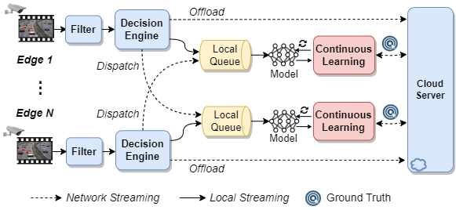

# EdgeCam

**EdgeCam is an edge-edge and edge-cloud collaborative framework for content-aware video analytics.**

## Overview
our system architecture, EdgeCam, consists of multiple edge nodes and one cloud server to efficiently handle video inference requests.
The main procedures and core modules are present as follows. 
Firstly, for the video collected from on-edge camera, our system support a filter engine that can determine whether a video frame needs to be filtered or not, so as to save the downstream resource costs.
Then, our system have a decision engine to intelligently select offloading strategies for video frames, while adjusting their resolutions and encoding qualities adaptively.

<div align="center">

</div>

## Workflow
EdgeCam supports three video analytics pipelines to process a video frame.
1. The video frame is first put into the local queue of the edge node and inferred with the local small DNN model. 
The edge node selects the regions of the video frame that have low recognition confidence from the recognition results, and encodes these parts of the image in specified quality and offloads them to the cloud for inference with the large DNN models.
2. The video frame can be directly dispatched to another edge node with a lighter workload for inference.
When another edge node receives the video frame, it can be processed through Case 1 of the video analytics pipelines.
3. The video frame can also be directly offloaded to the cloud for inference.

## Install
**1. System Requirements**

* [ubuntu 18.04](http://releases.ubuntu.com/18.04/)
* [Python 3.6.9](https://www.python.org/downloads/release/python-369/)
* [Jetpack 4.5](https://developer.nvidia.com/jetpack-sdk-45-archive)
* [cuda 10.2](https://developer.nvidia.com/cuda-toolkit)
* [pytorch 1.9.0](https://pytorch.org/)

**2. Edge Node** 

Please install the following libraries on each edge node.
* Install the corresponding version of [torch](https://forums.developer.nvidia.com/t/pytorch-for-jetson/72048), [torchvision](https://forums.developer.nvidia.com/t/pytorch-for-jetson/72048), and opencv-python.
* Install the following libraries.
```bash
pip3 install munch
pip3 install grpcio
pip3 install grpcio-tools
pip3 install loguru
pip3 install mysql-connector-python
pip3 install mapcalc
pip3 install APScheduler
pip3 install imutils
```

**3. Cloud**

Similar to the installation on the edge node, install the corresponding version of [torch](https://pytorch.org/get-started/previous-versions/), [torchvision](https://pytorch.org/get-started/previous-versions/) and required libraries.

**4. Database**

Please install and configure the MySQL database.
```bash
sudo apt install mysql-server
```
## Usage

To be able to start the service for video analytics, please configure it step by step.

**Step 1:** Modify the configuration file (config/config.yaml) as needed.
1. Video Source

If the video source is a video file, please configure the path of the video file.
```
video_path: your video path
```

If the video source is a network camera, please configure the account, password, and IP address.
```
rtsp:
 label: True
 account: your account
 password: your password
 ip_address: your camera ip
 channel: 1
```
2. IP configuration

Please configure the IP address of the cloud server.
```
server_ip: 'server ip:50051'
```

Please configure the number and IP addresses of edge nodes.
```
edge_id: the edge node ID
edge_num: the number of edge nodes
edges: ['edge ip 1:50051', 'edge ip 2:50051', ...]
```

3. Database

To be able to connect to the database, please configure user name, password, and ip address of the database.
```
connection: {'user': 'your name', 'password': 'your password', 'host': 'database ip', 'raise_on_warnings': True}
```

4. Offloading policy

Please configure offloading policy. 
```
policy: Edge-Cloud-Assited
```

For example:

- Edge-Cloud-Assisted: The inference for a video frame will be first conducted with the small DNN on the local edge, and the regions of the video frame that have low recognition confidence below a threshold will be offloaded to the cloud for inference with the large DNN model. The Edge node will not directly offload inference requests to the cloud.

- Edge-Cloud-Threshold: When the length of the local inference queue on the edge node exceeds a specified threshold, the edge node will directly offload the video frame to the cloud.

**Step 2:** Start the cloud server.
```bash
cd ~/EdgeCam
python3 cloud_server.py
```

**Step 3:** Start the edge node.

Please use the following command for each edge node.
```bash
cd ~/EdgeCam
python3 edge_client.py
```

## Contributing

If you have any questions, please feel free to contact us.
Email: guanyugao@gmail.com; gygao@njust.edu.cn; dongyuqi@njust.edu.cn

## License

MIT License

Copyright (c) 2023 Multimedia Systems and Networking Group

Permission is hereby granted, free of charge, to any person obtaining a copy
of this software and associated documentation files (the "Software"), to deal
in the Software without restriction, including without limitation the rights
to use, copy, modify, merge, publish, distribute, sublicense, and/or sell
copies of the Software, and to permit persons to whom the Software is
furnished to do so, subject to the following conditions:

The above copyright notice and this permission notice shall be included in all
copies or substantial portions of the Software.

THE SOFTWARE IS PROVIDED "AS IS", WITHOUT WARRANTY OF ANY KIND, EXPRESS OR
IMPLIED, INCLUDING BUT NOT LIMITED TO THE WARRANTIES OF MERCHANTABILITY,
FITNESS FOR A PARTICULAR PURPOSE AND NONINFRINGEMENT. IN NO EVENT SHALL THE
AUTHORS OR COPYRIGHT HOLDERS BE LIABLE FOR ANY CLAIM, DAMAGES OR OTHER
LIABILITY, WHETHER IN AN ACTION OF CONTRACT, TORT OR OTHERWISE, ARISING FROM,
OUT OF OR IN CONNECTION WITH THE SOFTWARE OR THE USE OR OTHER DEALINGS IN THE
SOFTWARE.
